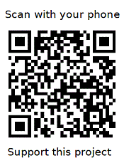

## 💻 KegLevel Lite Project
 
The **KegLevel Lite** app is a "stripped-down" version of the **KegLevel Monitor** app. It allows homebrewers to monitor and track the level of beer in up to 5 kegs.

Currently tested only on the Raspberry Pi 3B running Trixie and Bookworm. Should work with RPi4 and RPi5 running the same OS's but not yet tested.

Please **donate $$** if you use the app. 



## 💻 Suite of Apps for the Home Brewer
**🔗 [KettleBrain Project](https://github.com/keglevelmonitor/kettlebrain)** An electric brewing kettle control system

**🔗 [FermVault Project](https://github.com/keglevelmonitor/fermvault)** A fermentation chamber control system

**🔗 [KegLevel Lite Project](https://github.com/keglevelmonitor/keglevel_lite)** A keg level monitoring system

**🔗 [BatchFlow Project](https://github.com/keglevelmonitor/batchflow)** A homebrew batch management system

**🔗 [TempMonitor Project](https://github.com/keglevelmonitor/tempmonitor)** A temperature monitoring and charting system


## To Install the App

Open **Terminal** and run this command. Type carefully and use proper uppercase / lowercase because it matters:

```bash
bash <(curl -sL bit.ly/install-keglevel-lite)
```

That's it! You will now find the app in your application menu under **Other**. You can use the "Check for Updates" function inside the app to install future updates.

## 🔗 Detailed installation instructions

👉 (placeholder for detailed installation instructions)

## ⚙️ Summary hardware requirements

Required
* Raspberry Pi 3B (should work on RPi 4 but not yet tested)
* Debian Trixie OS (not tested on any other OS)

## ⚙️ Hardware Requirements

For the complete list of required hardware, part numbers, and purchasing links, please see the detailed hardware list:

➡️ **[View Detailed Hardware List](src/assets/hardware.md)**

## To uninstall the App

To uninstall, open **Terminal** and run this command. Type carefully and use proper uppercase / lowercase because it matters:

```bash
bash <(curl -sL https://bit.ly/uninstall-keglevel-lite)
```

## ⚙️ For reference
Installed file structure:

```
~/keglevel_lite/
|-- utility files...
|-- src/
|   |-- application files...
|   |-- assets/
|       |-- supporting files...
|-- venv/
|   |-- python3 & dependencies
~/keglevel_lite-data/
|-- user data...
    
Required system-level dependencies are installed via sudo apt outside of venv.

```


